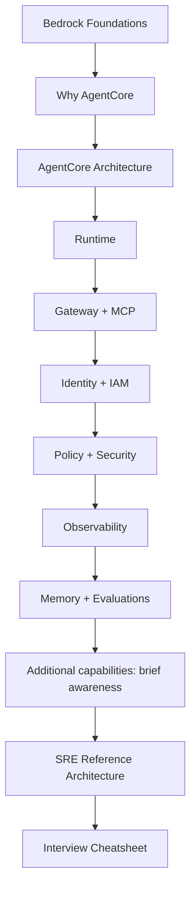

# Amazon Bedrock + Amazon Bedrock AgentCore for DevOps / Platform Engineering

A local Markdown learning workspace for a DevOps / Platform Engineer with about four years of experience across AWS/Azure, Kubernetes, Terraform, CI/CD, DevSecOps, observability, Python/Bash, and MCP.

**Objective:** understand how to operate secure AI-assisted infrastructure workflows without becoming an ML engineer. The recurring example is an **AI SRE assistant investigating why `payment-api` is unhealthy**.

## Start here

Read the theory in order, explain the architecture in your own words, then use the interview cheatsheet for revision. No AWS account, credentials, installation, or command execution is needed for this phase.

For a short introduction to document-based answers, read [Bedrock with RAG pipelines](theory/13-bedrock-rag-pipelines.md) after chapter 00. It is an optional companion chapter with basic terms and a flowchart.



## Learning sequence and depth

| Chapter | Focus | Depth |
|---|---|---|
| [00 — Bedrock foundations](theory/00-bedrock-foundations.md) | FMs, inference, prompts/tokens/context, RAG, Guardrails, Agents Classic | Working |
| [01 — Why AgentCore](theory/01-why-agentcore.md) | Production needs beyond model access | Working |
| [02 — Architecture](theory/02-agentcore-architecture.md) | Components, communication, and boundaries | Working |
| [03 — Runtime](theory/03-agentcore-runtime.md) | Deployment, invocation, sessions, scaling, versions, lifecycle | **Strong + practical** |
| [04 — Gateway + MCP](theory/04-agentcore-gateway-mcp.md) | Tool exposure, integration, access, and failures | **Strong + practical** |
| [05 — Identity + IAM](theory/05-agentcore-identity-iam.md) | Workload identity, credentials, roles, and least privilege | **Strong** |
| [06 — Policy + security](theory/06-agentcore-policy-security.md) | Cedar, enforcement, control comparison, human approval | Working |
| [07 — Observability](theory/07-agentcore-observability.md) | CloudWatch, OpenTelemetry, failure investigation | **Strong + practical** |
| [08 — Memory](theory/08-agentcore-memory.md) | Short/long-term context and session boundaries | Working |
| [09 — Evaluations](theory/09-agentcore-evaluations.md) | Task quality, tool correctness, release reliability | Working |
| [10 — Additional capabilities](theory/10-agentcore-additional-services.md) | Browser, Code Interpreter, A2A, Registry, Harness, Optimization | Awareness |
| [11 — SRE reference architecture](theory/11-sre-reference-architecture.md) | Diagnosis through approved remediation and verification | Strong applied synthesis |
| [12 — Interview cheatsheet](theory/12-interview-cheatsheet.md) | Flows, comparisons, and 15 interview questions | Compact revision |
| [13 — Bedrock with RAG pipelines](theory/13-bedrock-rag-pipelines.md) | Document preparation, retrieval, generation, and an SRE example | Surface-level awareness |

## Directory structure

```text
bedrock-agentcore-learning/
├── AGENTS.md
├── README.md
├── theory/
│   ├── 00-bedrock-foundations.md
│   ├── 01-why-agentcore.md
│   ├── 02-agentcore-architecture.md
│   ├── 03-agentcore-runtime.md
│   ├── 04-agentcore-gateway-mcp.md
│   ├── 05-agentcore-identity-iam.md
│   ├── 06-agentcore-policy-security.md
│   ├── 07-agentcore-observability.md
│   ├── 08-agentcore-memory.md
│   ├── 09-agentcore-evaluations.md
│   ├── 10-agentcore-additional-services.md
│   ├── 11-sre-reference-architecture.md
│   ├── 12-interview-cheatsheet.md
│   └── 13-bedrock-rag-pipelines.md
└── projects/
    └── README.md
```

## Scope now and later

The current repository contains theory only: concise explanations, source links, diagrams, an illustrative Cedar policy, and one proposed SRE architecture. It contains no infrastructure, implementation code, or executable labs.

Hands-on projects will be added incrementally in [projects/](projects/README.md). Possible topics include read-only incident diagnosis, governed MCP tooling, telemetry/evaluation, and approval-controlled changes. Future work should include least-privilege IAM, IaC, cost awareness, validation, and documented cleanup. The user executes commands and validates labs unless they explicitly ask otherwise. [AGENTS.md](AGENTS.md) provides reusable repository guidance.

## Verification, terminology, and assumptions

Official AWS documentation was checked on **2026-09-18**; factual sections link their sources. Examples and operational recommendations are labeled as designs, not deployed behavior.

- **Agents terminology:** AWS now calls the earlier managed agent service **Amazon Bedrock Agents Classic**. Its July 30, 2026 maintenance-mode change applies to that service, not all of Bedrock. [AWS notice](https://docs.aws.amazon.com/bedrock/latest/userguide/agents-classic-maintenance-mode.html)
- **Runtime baseline:** chapters use serverless microVMs. Current docs also describe Instances and persistence options, so avoid memorizing “every session is ephemeral” or “every compute type has an eight-hour maximum.” [Runtime](https://docs.aws.amazon.com/bedrock-agentcore/latest/devguide/agents-tools-runtime.html)
- **Gateway baseline:** diagrams focus on MCP tools. Current documentation also lists HTTP and inference targets; their feature sets differ. [Gateway concepts](https://docs.aws.amazon.com/bedrock-agentcore/latest/devguide/gateway-core-concepts.html)
- **Registry naming:** the dedicated guide uses **AWS Agent Registry**; the AgentCore overview also labels the capability **AgentCore Registry**. [Registry guide](https://docs.aws.amazon.com/bedrock-agentcore/latest/devguide/registry.html)
- **Policy scope:** the example is illustrative Cedar for a hypothetical tool schema. Current AWS docs also describe Dogwood temporal policies; those receive awareness coverage only. [Policy concepts](https://docs.aws.amazon.com/bedrock-agentcore/latest/devguide/policy-core-concepts.html)
- **Design assumptions:** one authorized incident scope, approved runbooks, reachable tool adapters, read-only diagnosis, and an external human-approval workflow with a separate executor. None has been implemented.
- **Before future labs:** recheck regional availability, GA/preview status, model/API compatibility, quotas, pricing, protocol contracts, supported policy/resource types, telemetry setup, and exact IaC provider support. No specific Region, model ID, or account is selected here.

Diagrams use Mermaid syntax for Markdown viewers that support Mermaid. The prose and tables remain usable without diagram rendering.
