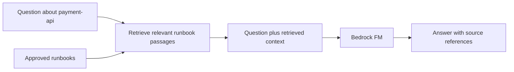

# 00 — ☁️ Bedrock foundations

**Depth: Working knowledge.** Example throughout: “Why is `payment-api` unhealthy?” Documentation checked: **2026-09-18**.

## Building blocks

| Concept | What and why | How it works / platform example | Interview memory hook |
|---|---|---|---|
| Amazon Bedrock | Managed access to foundation models; avoids operating model-serving infrastructure | Your application submits a request to a supported model API and receives generated output | Managed inference is one part of an AI application |
| Foundation model (FM) | A broadly pretrained model that can interpret and generate content | Explain a deployment failure using supplied events and logs | General knowledge does not include your live cluster |
| Inference | Running a model on supplied input | Send a question plus evidence; receive an answer or proposed tool calls | Inference uses a model; it does not train it |
| Prompt | Instructions and task context | “Use the evidence below, cite timestamps, and state uncertainty” | Instructions guide behavior; permissions enforce boundaries |
| Token | A unit the model processes, often a word fragment | Long logs consume input capacity and increase cost | Tokens are not equivalent to words |
| Context window | The model's bounded working input/output capacity, with model-specific accounting | Include selected logs, tool results, instructions, and recent conversation | More history is not always better evidence |

These terms describe application behavior; model training is outside this repository's scope. See the [Bedrock overview](https://docs.aws.amazon.com/bedrock/latest/userguide/what-is-bedrock.html).

## 📚 Knowledge Bases and RAG

**Retrieval Augmented Generation (RAG)** retrieves relevant information before generating an answer. Amazon Bedrock Knowledge Bases provides managed retrieval capabilities over your data. Current documentation distinguishes **Managed Knowledge Base** from **Customer-managed Knowledge Base**, with different infrastructure responsibilities and features. [AWS Knowledge Bases](https://docs.aws.amazon.com/bedrock/latest/userguide/knowledge-base.html)

- **Why:** The FM needs your organization's procedures and service knowledge.
- **How:** Prepare/index documents, retrieve relevant passages, supply them as model context, then return an evidence-based answer. [How Knowledge Bases work](https://docs.aws.amazon.com/bedrock/latest/userguide/kb-how-it-works.html)
- **SRE example:** Retrieve the payment readiness-probe runbook; separately obtain current EKS events through a tool.
- **Remember:** RAG supplies reference knowledge. Live tools supply current state. Check document permissions, freshness, and citations; retrieval does not guarantee correctness.

## 🔐 Amazon Bedrock Guardrails

Guardrails evaluate configured input/output content for concerns such as harmful content, denied topics, or sensitive information. Attach the appropriate guardrail to supported calls; merely creating one does not protect all traffic. [How Guardrails work](https://docs.aws.amazon.com/bedrock/latest/userguide/guardrails-how.html), [integration points](https://docs.aws.amazon.com/bedrock/latest/userguide/guardrails-use.html)

- **Why / example:** Reduce the chance of exposing sensitive incident details in a response.
- **How:** Configured filters assess content and can block or mask it according to their settings.
- **Interview:** Guardrails do not grant or revoke EKS permissions. Tool authorization belongs at execution boundaries.

## 🤖 Agents for Amazon Bedrock: current terminology

The service historically called **Agents for Amazon Bedrock / Amazon Bedrock Agents** supplies managed orchestration around models, action groups, and knowledge bases. An action group can expose a function such as retrieving deployment details. [AWS agent concepts](https://docs.aws.amazon.com/bedrock/latest/userguide/agents.html)

> ⚠️ AWS now calls it **Amazon Bedrock Agents Classic**. It entered maintenance mode and closed to new customers on **July 30, 2026**. Existing customers can continue using it. Bedrock model inference, Knowledge Bases, and Guardrails are unaffected. AWS directs new agent development toward AgentCore. [Official maintenance notice](https://docs.aws.amazon.com/bedrock/latest/userguide/agents-classic-maintenance-mode.html)

**Interview:** Distinguish the older managed agent service from AgentCore's modular platform. Do not describe all of Bedrock as being in maintenance mode.

[Next: Why AgentCore →](01-why-agentcore.md)
