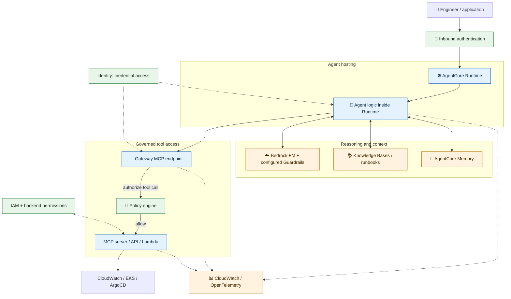

# 02 — ⚙️ AgentCore architecture

**Depth: Working knowledge.** Documentation checked: **2026-09-18**.

## What and why

Think of an agent as an application hosted **inside** Runtime. The agent calls a model and tools; the model does not independently receive an IAM role and operate your cluster. The diagram is an illustrative design using AgentCore's [modular services](https://docs.aws.amazon.com/bedrock-agentcore/latest/devguide/what-is-bedrock-agentcore.html).

Solid arrows describe calls or logical decisions; dotted arrows show supporting controls/telemetry. Gateway remains the caller of a target after Policy allows access; the policy engine does not execute tools.

## How requests move

| Step | Exchange | Operational meaning |
|---|---|---|
| 1 | Client → Runtime invocation | Authenticate, authorize, and bind the request to the correct session |
| 2 | Agent → Bedrock inference | Send the question and selected context |
| 3 | Agent → Knowledge Bases / Memory | Retrieve runbook passages or prior conversational context |
| 4 | Agent → Gateway | Discover and call a typed tool using MCP |
| 5 | Gateway → target | Check configured policy and use target-specific credentials |
| 6 | Target → backend | Apply AWS IAM, Kubernetes RBAC, or ArgoCD permissions |
| 7 | Tool result → agent → model → user | Turn timestamped evidence into a diagnosis |

The tool path uses [Gateway MCP aggregation](https://docs.aws.amazon.com/bedrock-agentcore/latest/devguide/gateway-core-concepts.html) and [Policy authorization](https://docs.aws.amazon.com/bedrock-agentcore/latest/devguide/policy-core-concepts.html). Retrieval and model calls are separate application decisions, not a mandatory fixed sequence.

## Example and interview recall

For `payment-api`, collect current readiness failures and the last ArgoCD revision, retrieve the matching runbook, then explain the likely cause. A tool error must remain visible as missing evidence.

- **Control plane:** configure artifacts, versions, endpoints, tool targets, and permissions.
- **Data plane:** invoke the deployed agent and execute authorized requests.
- **Security boundary:** approved tools and backend permissions constrain model-proposed actions.
- **Session boundary:** Runtime session, Memory session, policy session, and telemetry trace are distinct identifiers; correlate them deliberately.

[Next: Runtime →](03-agentcore-runtime.md)
