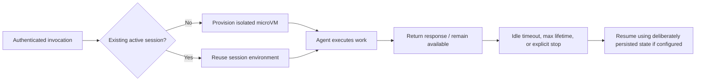

# 03 — ⚙️ AgentCore Runtime

**Depth: Strong + practical.** Documentation checked: **2026-09-18**. Deployment walkthrough is conceptual; there are no commands to execute.

## What and why

Runtime hosts agent or tool applications and handles execution infrastructure. This chapter uses **serverless microVMs** as the baseline. Current AWS documentation also describes **Instances**, backed by managed EC2 capacity in your account, for workloads needing different compute/lifecycle characteristics. Do not apply microVM isolation and duration claims to every compute mode. [Runtime overview](https://docs.aws.amazon.com/bedrock-agentcore/latest/devguide/agents-tools-runtime.html)

## How deployment works

One practical path is a container deployment:

1. **Prepare the application:** define input/output behavior and implement the selected Runtime protocol contract.
2. **Package an artifact:** for the documented HTTP container path, use ARM64, listen on `0.0.0.0:8080`, provide `POST /invocations` and `GET /ping`. Optional streaming changes response handling. [HTTP contract](https://docs.aws.amazon.com/bedrock-agentcore/latest/devguide/runtime-http-protocol-contract.html)
3. **Publish and configure:** reference the image in ECR; select an execution role, network access, authentication, and lifecycle configuration.
4. **Create the Runtime resource:** wait for readiness; investigate artifact, startup, or permission failures before invocation.
5. **Validate a version:** test read-only incident questions, authorization failures, dependency outages, and telemetry.
6. **Promote a named endpoint:** route production callers to a tested version and keep the previous version available for rollback.

The service also offers CLI/SDK deployment paths; the container example explains the underlying responsibilities. [microVM deployment model](https://docs.aws.amazon.com/bedrock-agentcore/latest/devguide/runtime-how-it-works.html)

## Versions and endpoints

| Object | Meaning | Suggested operational practice |
|---|---|---|
| Runtime | Agent deployment resource | Give each workload an owner and environment |
| Version | Immutable configuration snapshot created by updates | Record artifact digest, prompt/config revision, and evaluation results |
| `DEFAULT` endpoint | Automatically follows the latest Runtime version | Avoid treating it as a pinned production release |
| Named endpoint | References a selected version | Promote explicitly; repoint for rollback |

Endpoint status includes creation/update states, readiness, and failure states. A deployed version is useful only when its endpoint is ready and its dependencies work. [Versioning and endpoints](https://docs.aws.amazon.com/bedrock-agentcore/latest/devguide/agent-runtime-versioning.html)

## Invocation and sessions

An authenticated client invokes a Runtime ARN with a payload, endpoint qualifier, and Runtime session identifier. The application processes the request and returns JSON or supported streaming output. Reuse the session identifier for related turns; create a separate session for an independent investigation. [Invocation](https://docs.aws.amazon.com/bedrock-agentcore/latest/devguide/runtime-invoke-agent.html)

For our example, the first turn asks about `payment-api`; the next asks “What changed since the previous rollout?” Bind both to the authorized engineer and incident. A session ID is a routing/correlation value, **not proof of identity**.

This is a conceptual lifecycle, not an API state enum. Runtime microVMs isolate session CPU, memory, and filesystem. External data stores still need tenant-aware access controls. [Isolation](https://docs.aws.amazon.com/bedrock-agentcore/latest/devguide/agents-tools-runtime.html)

## Lifecycle, scaling, and reliability

- **Lifecycle:** Documented defaults are 15 minutes idle and 8 hours maximum lifetime. Current maximum settings differ: 8 hours for microVMs and 14 days for Instances. These bound execution environments; a logical session can continue with a replacement environment. Recheck before labs. [Lifecycle settings](https://docs.aws.amazon.com/bedrock-agentcore/latest/devguide/runtime-lifecycle-settings.html)
- **State:** Process memory is not durable storage. Runtime supports configured filesystem persistence; Memory is a separate service for conversational information. Decide what must survive stop/resume. [Runtime capabilities](https://docs.aws.amazon.com/bedrock-agentcore/latest/devguide/agents-tools-runtime.html)
- **Scaling:** Managed microVM capacity scales with sessions, but downstream model quotas, tool concurrency, and account limits can bottleneck. Set request budgets and bounded retries.
- **Networking:** Plan paths to Bedrock, Gateway, and private tools; VPC configuration requires working DNS, routes, and security groups. [VPC configuration](https://docs.aws.amazon.com/bedrock-agentcore/latest/devguide/agentcore-vpc.html)
- **Long-running work:** Use supported asynchronous behavior and accurate health/busy reporting. Background work should not silently outlive its execution environment.

## Flexibility and interview recall

Runtime can host custom agents and multiple frameworks and call models inside or outside Bedrock. HTTP, MCP, A2A, and AG-UI have different contracts; MCP exposes tools, while A2A supports agent collaboration. [Protocol contracts](https://docs.aws.amazon.com/bedrock-agentcore/latest/devguide/runtime-service-contract.html)

**Interview answer:** “I package the agent, configure its role/network/authentication, deploy a version, validate it, and promote a named endpoint. I monitor sessions and dependencies, preserve required state, and can roll back routing. The model service and tool backends scale separately.”

[Next: Gateway + MCP →](04-agentcore-gateway-mcp.md)
