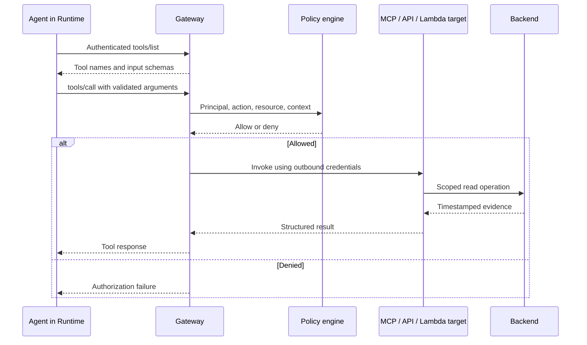

# 04 — 🔧 AgentCore Gateway + MCP

**Depth: Strong + practical.** Documentation checked: **2026-09-18**.

## What and why

Gateway centralizes connectivity to tools and other resources. For this learning path, use its **MCP aggregation** mode: supported APIs, Lambda functions, and remote MCP servers become tools exposed through a unified MCP endpoint. Current Gateway also supports HTTP passthrough and inference targets; their capabilities differ from MCP aggregation. [Gateway concepts](https://docs.aws.amazon.com/bedrock-agentcore/latest/devguide/gateway-core-concepts.html)

MCP standardizes discovery and invocation. It does not itself decide whether an engineer is allowed to modify production.

## How the tool flow works

The diagram assumes an enforcing Policy integration. Actual target access also depends on IAM, credential-provider configuration, and backend authorization. [Policy integration](https://docs.aws.amazon.com/bedrock-agentcore/latest/devguide/create-gateway-with-policy.html)

## Example tool design for payment-api

The following are **proposed tools**, not built-in AWS tool names.

| Tool | Possible integration | Deliberately narrow contract |
|---|---|---|
| `get_service_alarms` | Lambda wrapper around CloudWatch | Approved service and bounded time interval |
| `get_workload_events` | Private operations API or MCP server | Allowlisted cluster, namespace, and workload |
| `get_deployment_revision` | ArgoCD API wrapper | One approved application; read-only credentials |
| `request_remediation` | Approval workflow API | Produces a proposal; does not execute it |

For Lambda, define the tool schema and grant the Gateway role only the required invocation permissions. For APIs, describe operations with a supported schema and configure authentication. For existing MCP servers, configure a target and synchronize capabilities after relevant changes. [Target types and credentials](https://docs.aws.amazon.com/bedrock-agentcore/latest/devguide/gateway-core-concepts.html)

**Platform responsibilities:** version tool schemas, require precise descriptions, validate inputs again inside the tool, bound result sizes, and preserve timestamps/source references. Tool discovery must not be treated as permission to execute every listed tool.

## Authentication and authorization

- **Inbound:** Verify the agent/client at Gateway using a supported configured authorizer, such as IAM/SigV4 or OAuth JWT.
- **Policy:** Decide whether that principal can invoke this tool with these arguments.
- **Outbound:** Authenticate Gateway to the target using the target's supported role or credential mechanism.
- **Backend:** The tool's own identity still needs permission to read CloudWatch, EKS, or ArgoCD.

A successful inbound login cannot compensate for expired outbound credentials. Avoid exposing an alternative backend path with broader permissions than the Gateway path.

## Failures and SRE response

| Symptom | Investigate | Safe response |
|---|---|---|
| Tool absent or input rejected | Target synchronization, naming, schema drift | Refresh the contract; do not invent arguments |
| Authentication failure | Token issuer/audience/expiry or SigV4 configuration | Repair the relevant credential boundary |
| Policy denial | Principal, action name, resource, input conditions | Compare against intended access; do not bypass |
| Target access denied | Gateway execution role or credential provider | Check the outbound identity separately |
| EKS forbidden | Tool identity and Kubernetes authorization | Verify namespace/resource scope |
| Timeout or throttling | Target health, DNS, network, rate limits | Bounded retry for safe reads; expose missing evidence |
| Ambiguous write result | Action may have completed before timeout | Query status using an operation ID before retrying |

These are suggested operational checks, not universal HTTP status mappings. MCP errors may be carried inside a successful HTTP transport response.

**Interview:** “Gateway provides a governed tool entry point. I separate client authentication, tool authorization, target authentication, and backend permissions, then trace failures across those boundaries.”

[Next: Identity + IAM →](05-agentcore-identity-iam.md)
