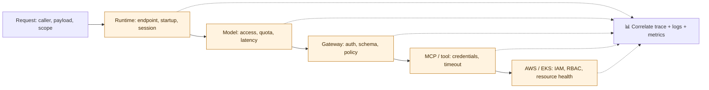

# 07 — 📊 AgentCore Observability

**Depth: Strong + practical.** Documentation checked: **2026-09-18**.

## What and why

AgentCore Observability exposes operational telemetry through CloudWatch and OpenTelemetry-compatible signals. It helps distinguish a failed agent request from a failed model call or tool invocation. Built-in metrics exist, but detailed application traces and some service logs/spans require explicit setup. [Observability overview](https://docs.aws.amazon.com/bedrock-agentcore/latest/devguide/observability.html)

## How to make the system observable

1. Enable the required CloudWatch setup, including Transaction Search for the documented trace experience.
2. Instrument custom agent code with supported OpenTelemetry/ADOT integration and configure export permissions.
3. Enable relevant service logs/traces and propagate trace context through tool wrappers.
4. Correlate request ID, trace ID, Runtime session, endpoint/version, tool name, and incident ID.
5. Check an intentional failed read to verify the trace contains the responsible boundary.

These are future setup responsibilities, not actions performed by this repository. [Configuration](https://docs.aws.amazon.com/bedrock-agentcore/latest/devguide/observability-configure.html), [service-provided telemetry](https://docs.aws.amazon.com/bedrock-agentcore/latest/devguide/observability-service-provided.html)

| Signal | What it explains | Useful example |
|---|---|---|
| Logs | Discrete events and error details | Tool returned Kubernetes `Forbidden` |
| Metrics | Trends, rates, and percentiles | Rising tool error rate after a release |
| Traces / spans | Causal path and per-step timing | Most request time spent waiting on one target |
| Sessions | Related conversation/workflow activity | Failed follow-up belongs to the same incident |
| Token usage | Model input/output volume where instrumented | Repeated full-log prompts increased consumption |

A session can contain multiple traces. Trace data is operational evidence, not guaranteed access to a model's hidden internal reasoning.

## Troubleshooting flow

This is an investigation order; the agent orchestrates calls and the model does not directly call Gateway.

| Failure boundary | Evidence to inspect | Next diagnostic step |
|---|---|---|
| Request / inbound auth | Request ID, token validation failure, intended audience | Check issuer, expiry, audience, and selected auth mode; never log tokens |
| Runtime | Endpoint/version, startup logs, invocation errors, throttles | Check readiness, protocol contract, session lifecycle, and quotas |
| Model | Model span, access denial, throttling, input/output usage | Check model/Region access and request size; compare latency to baseline |
| Gateway | Tool action, schema, request/target timing | Separate Gateway overhead from target duration |
| Policy | Decision, determining policies, input/principal mismatch | Verify engine association and enforcement mode |
| Tool / outbound auth | Provider operation, credential error, tool logs | Separate expired credentials from network failure |
| EKS / ArgoCD | Backend authorization and workload events | Verify namespace/app scope, then inspect actual deployment health |

AWS references: [Runtime signals](https://docs.aws.amazon.com/bedrock-agentcore/latest/devguide/observability-runtime-metrics.html), [Gateway signals](https://docs.aws.amazon.com/bedrock-agentcore/latest/devguide/observability-gateway-metrics.html), [Identity signals](https://docs.aws.amazon.com/bedrock-agentcore/latest/devguide/observability-identity-metrics.html).

## Signals worth putting on a platform dashboard

- **Request reliability:** successful completed investigations / attempted investigations; distinguish degraded diagnoses from complete ones.
- **Latency:** p50/p95 end-to-end, time to first response, model duration, and tool duration. Metric names do not guarantee identical semantics across services.
- **Capacity/cost:** active sessions, throttles, calls per incident, input/output tokens, and cost per useful diagnosis.
- **Security:** authentication failures and policy denials, separated from backend execution errors.
- **Quality:** grounded diagnoses and correct tool usage from [Evaluations](09-agentcore-evaluations.md).

Policy telemetry includes `AllowDecisions`, `DenyDecisions`, and policy mismatch signals; traces can explain which policies determined a decision. An expected denial can demonstrate a working control, while a sudden denial spike after a release needs investigation. [Policy telemetry](https://docs.aws.amazon.com/bedrock-agentcore/latest/devguide/observability-policy-metrics.html)

## payment-api example and interview recall

The assistant reports “insufficient evidence.” The trace shows successful inference, an allowed event-tool call, and an EKS authorization failure inside the tool. Repair the tool's intended namespace access after review; changing the prompt will not fix RBAC.

**Operating practice:** redact secrets and sensitive payloads before export; set retention/access controls and avoid high-cardinality user IDs as metric dimensions. A successful HTTP request is not proof of a successful investigation or tool result.

**Interview:** “I follow one correlated request through Runtime, model, Gateway, tool, and backend, find the failing or slow span, then verify the identity and permissions at that hop.”

[Next: Memory →](08-agentcore-memory.md)
