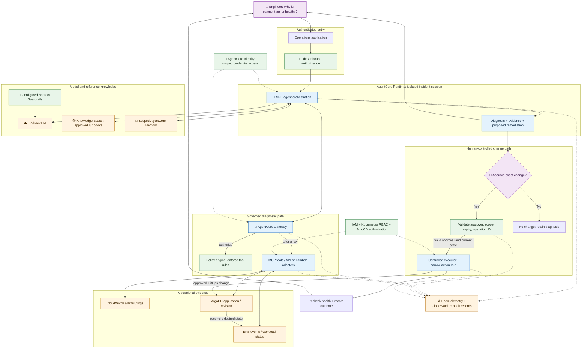

# 11 — 🤖 AI SRE / Platform Operations Assistant

**Depth: Strong applied synthesis.** Documentation checked: **2026-09-18**.

## What and why

An illustrative assistant answers **“Why is payment-api unhealthy?”**, gathers read-only evidence, recommends a change, and routes any mutation through human approval. This is a proposed architecture, not an AWS-provided turnkey solution or an implemented project.

## End-to-end architecture

Solid arrows are calls, results, or workflow progression; dotted arrows are controls/telemetry. The application orchestrates retrieval and model calls. The separate change path is a design choice: this diagnostic agent cannot directly invoke the executor or change backend state.

## One incident, step by step

| Step | Evidence / decision | Required boundary |
|---|---|---|
| 1. Establish scope | Engineer selects production, cluster, `payments`, `payment-api` | Validate user access; do not trust prompt-supplied tenant identity |
| 2. Gather context | Retrieve the current readiness runbook and selected conversation history | Authorized retrieval and memory scope |
| 3. Read live state | Query alarms, pod events, and deployed revision through Gateway tools | Policy, outbound credentials, IAM/RBAC |
| 4. Diagnose | Correlate readiness failures with a recent configuration change | Cite timestamps and sources; disclose unavailable evidence |
| 5. Recommend | Propose an exact reviewed configuration revert with expected impact | No mutation yet; attach the diff and rollback considerations |
| 6. Approve | Authorized engineer reviews action, environment, and risk | External trusted approval record, expiry, unique operation ID |
| 7. Execute | Executor validates approval and current revision, then uses the allowed GitOps path | Narrow executor role; prevent duplicate execution |
| 8. Verify | Check readiness/error rate after reconciliation and record outcome | Read-only checks; escalate if recovery is not demonstrated |

**Illustrative diagnosis:** “Readiness failures began after revision R42 changed the probe path. Current events and the approved runbook support reverting that configuration. I have not changed production.” This is an example, not a finding from a real cluster.

## Production design choices to remember

- Private EKS/ArgoCD connectivity needs explicitly designed network paths; Gateway does not make private endpoints reachable automatically.
- No general-purpose privileged shell tool. Prefer typed, bounded operations and restricted output.
- Treat runbooks, logs, and tool responses as data that may contain prompt injection.
- Keep approval/action status in an authoritative workflow store. A Memory record cannot approve a rollout.
- Record who requested, approved, and executed the change alongside endpoint version, tool arguments, operation ID, and outcome.
- If evidence is missing, return a partial diagnosis. If a write times out, reconcile its status before retrying.
- Evaluate the assistant against known incidents before promoting configuration changes.

These are recommended design decisions assembled from the earlier chapters. Service building blocks are documented in [Runtime](https://docs.aws.amazon.com/bedrock-agentcore/latest/devguide/agents-tools-runtime.html), [Gateway](https://docs.aws.amazon.com/bedrock-agentcore/latest/devguide/gateway-core-concepts.html), [Policy](https://docs.aws.amazon.com/bedrock-agentcore/latest/devguide/policy-core-concepts.html), and [observability setup](https://docs.aws.amazon.com/bedrock-agentcore/latest/devguide/observability-configure.html).

**Interview:** “My assistant diagnoses with scoped read-only tools. A trusted workflow approves a concrete change, a separate executor applies it, and telemetry plus health checks prove the outcome.”

[Next: Interview cheatsheet →](12-interview-cheatsheet.md)
