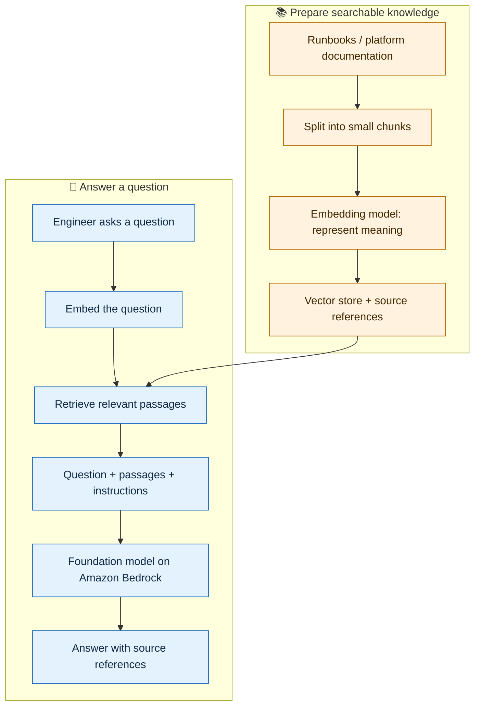

# 13 — 📚 Bedrock with RAG pipelines

**Depth: Surface-level awareness.** Read after [Bedrock foundations](00-bedrock-foundations.md). Documentation checked: **2026-09-18**.

## What is RAG, and why use it?

**RAG = Retrieval Augmented Generation:** find relevant information, add it to the question, and ask a model to answer using that information.

Think of an open-book exam: the model can consult your approved documents before answering. This helps it answer questions about internal runbooks and platform procedures without retraining the model. [AWS explanation](https://docs.aws.amazon.com/bedrock/latest/userguide/kb-how-it-works.html)

## Basic terms

| Term | Simple meaning |
|---|---|
| Data source | Where documents live, such as runbooks in Amazon S3 |
| Ingestion | Preparing documents so they can be searched |
| Chunk | A small piece of a document |
| Embedding | Numbers representing the meaning of text |
| Vector store | A searchable index of embeddings and their associated content |
| Retrieval | Finding passages relevant to a question |
| Generation | A model writing an answer using the question and retrieved passages |

## How the pipeline works

This diagram shows a common text/vector RAG pipeline. Preparation runs when documents are added or updated; the question path runs for each user request. [AWS pipeline description](https://docs.aws.amazon.com/bedrock/latest/userguide/kb-how-it-works.html)

## Where does Bedrock fit?

| Approach | Bedrock's role | Your platform responsibility |
|---|---|---|
| Use **Amazon Bedrock Knowledge Bases** | Provides retrieval capabilities and can combine retrieved information with model-generated answers | Connect approved data, configure access, and check answer quality |
| Build a custom RAG pipeline | Supplies supported embedding and answer-generation models | Assemble ingestion, storage, retrieval, and application logic |

Knowledge Bases currently distinguishes **Managed Knowledge Base**, where AWS manages more of the underlying pipeline, from **Customer-managed Knowledge Base**, where you control more infrastructure and configuration. Their features differ. [AWS Knowledge Bases overview](https://docs.aws.amazon.com/bedrock/latest/userguide/knowledge-base.html)

## 🔧 Simple SRE example

**Question:** “What should I check when `payment-api` fails its readiness probe?”

1. Retrieve the approved readiness-probe runbook.
2. Pass the relevant passages and question to the Bedrock model.
3. Return a short checklist with references to the runbook.

For “Why is it unhealthy **right now**?”, also fetch current pod events and deployment details through authorized tools. Documents explain procedures; live evidence supports the current diagnosis. See the [SRE architecture](11-sre-reference-architecture.md).

## What should a Platform Engineer remember?

- Keep documents fresh and verify that changed content has reached the searchable index.
- Enforce document access before passing passages to the model; content filtering cannot replace authorization.
- Treat retrieved instructions as untrusted data, especially when they ask the agent to take actions.
- Check retrieval relevance and source references. RAG can still produce incorrect answers.
- A basic question-answering RAG application does not require an agent loop. Add agent orchestration when the workflow needs tools or multiple steps.

**Interview answer:** “RAG searches our documents and supplies relevant passages to a Bedrock model. It helps answer questions using internal knowledge without model retraining. I focus on document freshness, permissions, retrieval quality, and evidence-backed answers.”

[Back to learning sequence](../README.md)
